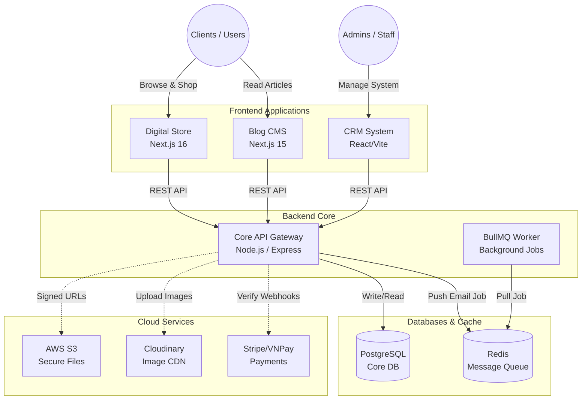

<div align="center">
  

  <p>
    <a href="https://nextjs.org/"></a>
    <a href="https://nodejs.org/"></a>
    <a href="https://expressjs.com/"></a>
    <a href="https://www.prisma.io/"></a>
    <a href="https://www.postgresql.org/"></a>
    <a href="https://redis.io/"></a>
    <a href="https://aws.amazon.com/s3/"></a>
    <a href="https://www.docker.com/"></a>
  </p>
  
  <p>
    <i>A comprehensive, scalable, and modern E-Commerce and CRM ecosystem built with a microservices-oriented monorepo architecture. <b>(Now Production-Ready on Cloud)</b></i>
  </p>
</div>

---

## 📖 Overview

This repository houses a complete **E-Commerce & CRM Ecosystem**. Designed with a **Service-Oriented Architecture (SOA)**, the system is highly scalable and maintainable, making it suitable for enterprise-level deployments. It orchestrates multiple independent applications handling different business domains—from customer-facing digital storefronts and SEO-optimized blogs to internal administration and powerful core APIs.

> **Production Deployment:** This project is now deployed on Cloud environments. It utilizes AWS S3 for secure digital asset delivery, Cloudinary for lightning-fast image CDNs, and Redis/BullMQ for asynchronous background jobs.

## 📚 Documentation

For a deep dive into the architecture, deployment instructions, and API references, please read our newly updated **[Documentation Folder (`/docs`)](./docs)**.

- [System Architecture](./docs/02-system-design/architecture.md)
- [Deployment Guide (Docker)](./docs/08-deployment/docker.md)
- [Environment Variables Config](./docs/08-deployment/environment.md)
- [Changelog](./docs/01-overview/changelog.md)

## 🏗 System Architecture

The project is structured as a **Monorepo**, leveraging modern tooling to share configurations and packages across multiple applications.



## 📂 Ecosystem Structure

All applications reside within the `apps/` directory, while shared resources and configurations are managed in `packages/`.

### 1. [Backend Core (`apps/backend-core`)](./apps/backend-core)

- **Role:** The heart of the ecosystem. It handles complex business logic, database transactions, robust authentication, role-based access control (RBAC), and serves a RESTful API.
- **Tech Stack:** Node.js, Express, Prisma ORM, PostgreSQL, Redis, BullMQ, JWT.

### 2. [Digital Store (`apps/digital-store`)](./apps/digital-store)

- **Role:** The customer-facing digital storefront. Optimized for Core Web Vitals, SEO, and seamless user experience for purchasing digital products.
- **Tech Stack:** Next.js 16, React 19, Tailwind CSS, Zustand.

### 3. [CRM System (`apps/crm-system`)](./apps/crm-system)

- **Role:** The internal administration portal. Features advanced dashboards, order tracking, product management, and revenue analytics.
- **Tech Stack:** React 19, Vite, Tailwind CSS, React Query, Lucide Icons.

### 4. [Blog & CMS (`apps/blog-cms`)](./apps/blog-cms)

- **Role:** A content management system designed to drive organic traffic and boost inbound marketing.
- **Tech Stack:** Next.js 15, PostgreSQL, Prisma, Tailwind CSS.

---

## ✨ Key Features (Version 1.1)

- **Cloud Media Storage:** Direct integration with **AWS S3** for secure, time-limited digital product downloads (Signed URLs) and **Cloudinary** for highly optimized image delivery.
- **Background Processing:** Implemented **Redis + BullMQ** to offload heavy tasks like sending emails (invoices, password resets) to background workers, ensuring blazing fast API response times.
- **Enterprise-Grade Payments:** Stripe and VNPay integrations with advanced Webhook validation and row-level locking (concurrency control) to prevent race-condition exploits.
- **Robust Backend Core:** RESTful APIs built with Node.js & Express, utilizing Prisma ORM for type-safe database interactions with PostgreSQL.
- **Advanced Authentication:** Secure JWT-based auth system with Role-Based Access Control (RBAC) separating Customers and Admins.
- **Containerized Ecosystem:** Docker Compose configuration orchestrating the entire stack (Node.js, PostgreSQL, Redis) for unified deployments.

---

## 🚀 Getting Started (Docker Compose)

The entire ecosystem is fully containerized. You can spin up the development or production environment with a single command.

### Prerequisites

- [Docker](https://www.docker.com/products/docker-desktop) and Docker Compose installed.
- Cloud accounts configured (AWS, Cloudinary, Stripe) if running in Production mode.

### Installation

1. **Clone the repository:**

   ```bash
   git clone https://github.com/dangtienvn/e-cormmerce-platform.git
   cd e-cormmerce-platform
   ```

2. **Environment Setup:**
   Duplicate the `.env.example` files in each application to `.env` and fill in the necessary database and cloud credentials (Refer to `docs/08-deployment/environment.md`).
3. **Spin up the Ecosystem:**
   Use the provided Docker Compose configuration to start all services, databases, and message queues:

   ```bash
   docker-compose up -d --build
   ```

4. **Access the Applications:**
   - Digital Store: `http://localhost:3002`
   - Blog CMS: `http://localhost:3003`
   - CRM System: `http://localhost:3001`
   - Backend API: `http://localhost:5000`

---

## 👨‍💻 Author & Contact

This project is actively developed and maintained as a demonstration of software engineering best practices, monorepo architecture, and modern web development.

- **Author:** Đặng Thanh Tiến (Thanh Tien Dang)
- **Email:** dangthanhtien.dev@gmail.com
- **Phone:** 0363226094
- **LinkedIn:** [Thanh Tien Dang](https://www.linkedin.com/in/thanh-tien-dang/)

---

<div align="center">
  <i>Built with passion and commitment to clean, scalable code.</i>
</div>
