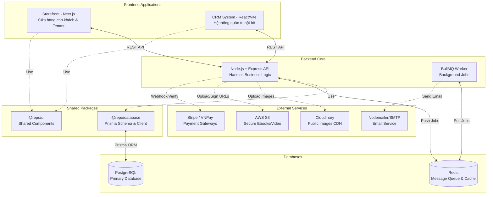

# Kiến Trúc Hệ Thống (System Architecture)

Dự án E-commerce Platform được xây dựng theo mô hình Monorepo (đa ứng dụng chung một kho chứa mã nguồn). Kiến trúc được thiết kế nhằm tách biệt các Front-end (Client-facing) với Backend (API & Logic), sử dụng các gói chia sẻ (Shared Packages) cho Database và UI, đồng thời sử dụng các dịch vụ bên thứ ba (Third-party Services) để đảm nhiệm các tác vụ chuyên biệt nhằm tối ưu hóa hiệu suất và bảo mật.

## Tổng Quan Mô Hình

Hệ thống bao gồm **2 ứng dụng Frontend** và **1 ứng dụng Backend**, cùng chia sẻ tài nguyên qua `packages/*` và giao tiếp qua giao thức RESTful API.

## Các Thành Phần Chính

### 1. Frontend Layer
Được chia thành các dự án độc lập trong thư mục `apps/`:
- **Storefront (Next.js):** Nơi khách hàng truy cập, tìm kiếm sản phẩm, thanh toán giỏ hàng. Ứng dụng Next.js App Router hỗ trợ định tuyến Multi-tenant (subdomain) và được tối ưu tối đa cho SEO.
- **CRM System (React + Vite):** Trang quản trị SPA dành cho Creator, Admin và Manager. Sử dụng `React Query` để gọi API và cache dữ liệu phía client.

### 2. Shared Packages Layer
Các thư viện dùng chung được đặt tại thư mục `packages/` sử dụng tính năng NPM Workspaces:
- **@repo/database:** Chứa định nghĩa Prisma schema, migration và Prisma Client được tái sử dụng trong toàn bộ hệ thống.
- **@repo/ui:** Chứa các React component dùng chung cho các ứng dụng frontend.
- **@repo/theme-engine, @repo/types,...:** Các tiện ích và định nghĩa kiểu dữ liệu dùng chung.

### 3. Backend API Layer (Node.js + Express)
Đây là trung tâm xử lý logic toàn bộ hệ thống.
- **Kiến trúc Module:** Được chia thành các module nhỏ (`user`, `auth`, `payment`, `order`,...) theo nguyên tắc Single Responsibility.
- **ORM:** Tích hợp package `@repo/database` để thao tác với PostgreSQL.
- **Xác thực:** Dùng JWT Token kết hợp Access Token (ngắn hạn) và Refresh Token (dài hạn lưu trong HTTP-Only Cookie).

### 4. Background Jobs Layer (BullMQ + Redis)
- Nhằm tránh tình trạng API bị nghẽn (Blocking) do phải chờ đợi gửi Email mất quá nhiều thời gian, hệ thống tách tiến trình gửi Email ra riêng.
- Khi có sự kiện (VD: Người dùng quên mật khẩu), Backend API chỉ ghi 1 Job vào `Redis` rồi trả về Success ngay lập tức.
- File `mail.worker.js` sẽ chạy ngầm, liên tục lắng nghe `Redis` và thực hiện gửi Email (SMTP). Có cơ chế tự động thử lại (Retry) nếu gửi lỗi.

### 5. Storage & Media
- **Cloudinary:** Toàn bộ ảnh (Thumbnail sản phẩm, Avatar) được upload thẳng lên Cloudinary thông qua SDK và lưu link trên Database. Nhờ vậy, ảnh luôn được tối ưu (Webp/CDN).
- **AWS S3:** Đặc thù bán sản phẩm số (Digital Products), các file như Ebook PDF hoặc Video khóa học được đẩy vào một Private Bucket trên AWS S3. Khi khách hàng bấm tải xuống, Backend sẽ liên kết với AWS và cấp 1 đường link Signed URL có tuổi thọ 15 phút, ngăn chặn tuyệt đối tình trạng chia sẻ link lậu.

### 6. Cổng Thanh Toán (Payment Gateways)
- Hỗ trợ **VNPay** (Thanh toán ATM nội địa / Mã QR).
- Hỗ trợ **Stripe** (Thanh toán thẻ tín dụng quốc tế Visa/Mastercard).
- Cơ chế Webhook: Cổng thanh toán sẽ "bắn" thông báo (IPN) ngược về Backend của chúng ta. API được thiết kế kèm theo cơ chế "Row Lock" (Kiểm tra và khóa dòng dữ liệu) để tránh trùng lặp thanh toán.
